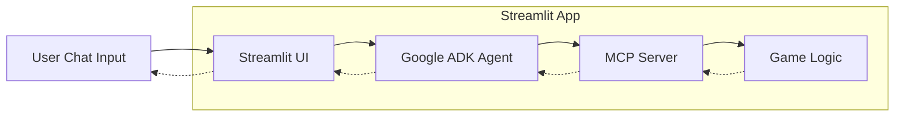

# 🎮 MCP Maze Runner

An interactive maze game controlled through natural language chat, built to demonstrate the Model Context Protocol (MCP) integration with AI agents.

## Overview

**MCP Maze Runner** is an educational project that showcases how to build an AI-powered game using the Model Context Protocol. Players navigate a maze by chatting with an AI agent, which uses MCP tools to control the game. The agent interprets natural language commands like "move forward" or "look around" and translates them into game actions.

### Architecture



## Features

### Core Features

- **Natural Language Control**: Command your character using plain English
- **Interactive Maze**: Navigate through a grid-based maze with obstacles
- **AI-Powered Agent**: Intelligent interpretation of player intentions
- **MCP Integration**: Full implementation of Model Context Protocol
- **Streamlit UI**: User-friendly web interface for gameplay

### Game Mechanics

- 🚶 **Movement**: Navigate in four directions (Up, Down, Left, Right)
- 🧱 **Obstacles**: Walls block your path, requiring strategic thinking
- 🔑 **Keys**: Collect keys to unlock special doors
- 🚪 **Exit**: Find and reach the maze exit to win

### MCP Tools Exposed

- `move(direction)` - Move the player in a cardinal direction (up, down, left, right)
- `look_around(visibility_range)` - See nearby cells, walls, keys, and available moves
- `get_game_state()` - Get complete game state (position, keys, moves, status)
- `get_maze_display(fog_of_war)` - Get ASCII visualization of the maze
- `reset_game()` - Reset the game to start fresh with a new maze

## Installation & Usage

### 1. Install uv if you haven't already:

```bash
# macOS/Linux
curl -LsSf https://astral.sh/uv/install.sh | sh

# pip
pip install uv
```

### 2. Clone and Setup:

```bash
# clone the repo
git clone https://github.com/MarinCervinschi/mcp-maze-runner.git
cd mcp-maze-runner

# install dependencies
uv sync
```

### 3. Configure API Key

- Create a `.env` file in the `root_agent` directory with your Google API key:

```text
GOOGLE_API_KEY=your_google_api_key_here
```

you can obtain an API key from the [Google AI Studio](https://aistudio.google.com/api-keys).

### 4. Run the Streamlit UI:

```bash
uv run streamlit run main.py
```

- This launches the Streamlit web interface with the MCP server running in-process.
- Open your browser and navigate to [http://localhost:8501](http://localhost:8501).
- Chat with the AI agent to navigate the maze!

### 5. Debug with ADK Web (Development):

```bash
uv run python dev_main.py
```

- This starts the MCP server and the ADK web interface for testing and debugging.
- Open your browser and navigate to [http://localhost:8000](http://localhost:8000).
- Select the `root_agent` on the left panel and start a new chat session.

### 6. Play in Terminal (No AI):

```bash
uv run python run_game.py
```

- This will start the game in your terminal, allowing you to interact with the maze directly.
- In this mode you don't use the AI agent or the MCP tools, but it's a fun way to experience the maze!

### Running Tests

```bash
uv run pytest tests/ -v
```

## Technology Stack


## License

MIT License - feel free to use this project for learning and teaching.
