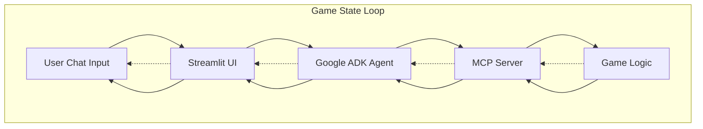

# 🎮 MCP Maze Runner

An interactive maze game controlled through natural language chat, built to demonstrate the Model Context Protocol (MCP) integration with AI agents.

## Overview

**MCP Maze Runner** is an educational project that showcases how to build an AI-powered game using the Model Context Protocol. Players navigate a maze by chatting with an AI agent, which uses MCP tools to control the game. The agent interprets natural language commands like "move forward" or "look around" and translates them into game actions.

### Architecture



## Features

### Core Features
- **Natural Language Control**: Command your character using plain English
- **Interactive Maze**: Navigate through a grid-based maze with obstacles
- **Visual Interface**: Real-time maze visualization in the browser
- **AI-Powered Agent**: Intelligent interpretation of player intentions
- **MCP Integration**: Full implementation of Model Context Protocol

### Game Mechanics
- 🚶 **Movement**: Navigate in four directions (North, South, East, West)
- 🧱 **Obstacles**: Walls block your path, requiring strategic thinking
- 🔑 **Keys**: Collect keys to unlock special doors
- 🚪 **Exit**: Find and reach the maze exit to win
- 👁️ **Visibility**: Limited field of view creates exploration challenge

### MCP Tools Exposed
- `move(direction)` - Move the player in a cardinal direction (north, south, east, west)
- `look_around(visibility_range)` - See nearby cells, walls, keys, and available moves
- `get_game_state()` - Get complete game state (position, keys, moves, status)
- `get_maze_display(fog_of_war)` - Get ASCII visualization of the maze
- `reset_game()` - Reset the game to start fresh with a new maze

## Installation & Usage

### Quick Start

```bash
# Clone the repository
git clone https://github.com/MarinCervinschi/mcp-maze-runner.git
cd mcp-maze-runner

# Install dependencies with uv
uv sync

# Run the MCP server
uv run mcp-maze-runner
```

### Running Tests

```bash
uv run pytest tests/ -v
```

## Technology Stack

### Backend
- **Python 3.10+**: Core programming language
- **MCP Library** (`mcp`): Model Context Protocol implementation
- **Google ADK**: AI agent framework with Gemini integration

### Frontend
- **Streamlit**: Web-based UI framework
- **HTML/CSS**: Custom maze visualization

### Deployment
- **Docker**: Containerization for consistent deployment

## Requirements

See [docs/requirements.md](docs/requirements.md) for detailed functional and non-functional requirements.

## Contributing

Contributions are welcome! This is an educational project, so feel free to:
- Add new maze layouts
- Implement additional game mechanics
- Improve AI agent prompts
- Enhance UI/UX
- Fix bugs or optimize code

## License

MIT License - feel free to use this project for learning and teaching.